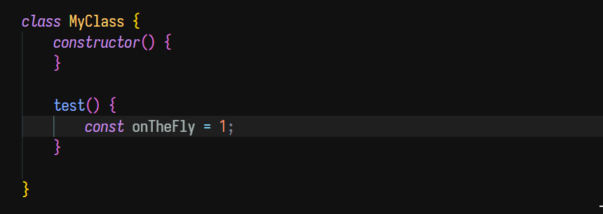
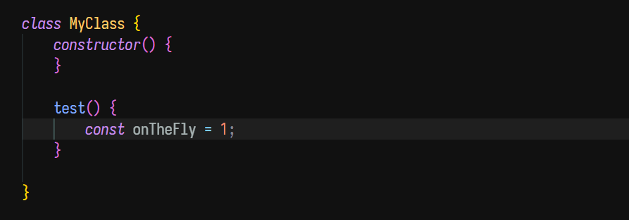

# cfjb-js-logger README

Configurable logger extension for Javascript.

## Features

Support use on both selected text and unselected space.

## Usage

* Use on selected text

    1. Select text
    2. Press `Ctrl+Shift+L`

    screenshot:

    

* Use on unselected space

    1. Press `Ctrl+Shift+L`

    

## Extension Settings

This extension contributes the following settings:

    "loggerFunction": {
        "type": "string",
        "default": "logger.debug",
        "description": "Logger's log function string."
    },
    "insertFunctionNameEnabled": {
        "type": "boolean",
        "default": true,
        "description": "Enable inserting function name."
    },
    "functionNameSuffix": {
        "type": "string",
        "default": "_",
        "description": "Function name suffix which will be added after function name string."
    },
    "useSemiColon": {
        "type": "boolean",
        "default": "true",
        "description": "Use semi colon after function call."
    }
